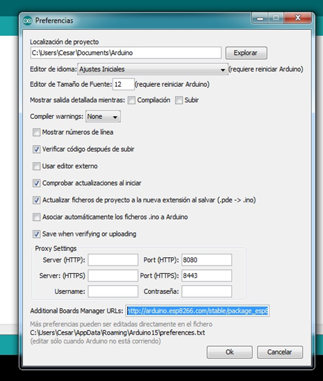
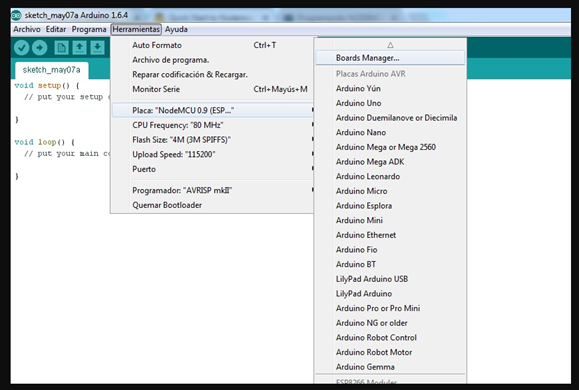
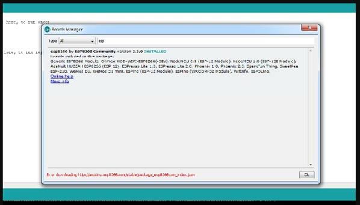
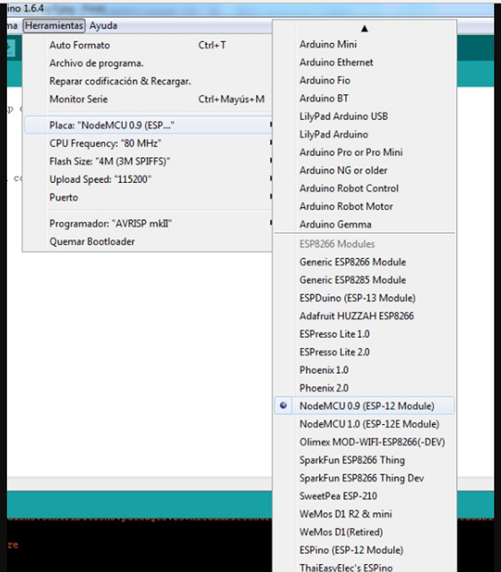

# ESP8266_HowToInstall
How to Install ESP8266 on Arduino IDE

Instalar el IDE de aduino.
Una vez tienes instalado el entorno de programación debes configurarlo para poder empezar a trabajar con NodeMCU, para configurarlo debes clickear en "Archivo", luego "Preferencias".

En la casilla "Additional Boards Manager URLs" debes escribir la siguiente dirección : 
http://arduino.esp8266.com/stable/package_esp8266com_index.json
Después de clickear "Ok" deberás instalar el plugin de NodeMCU.
El siguiente paso para instalar el plugin será acceder a "Herramientas", luego seleccionar "Placa:" y después clickear en "Boards Manager"

Una vez accedes a "Boards Manager" deberás buscar ESP8266,

Y una vez instalado, ya podrás acceder a la configuración de la placa NodeMCU para programar tu tarjeta.

